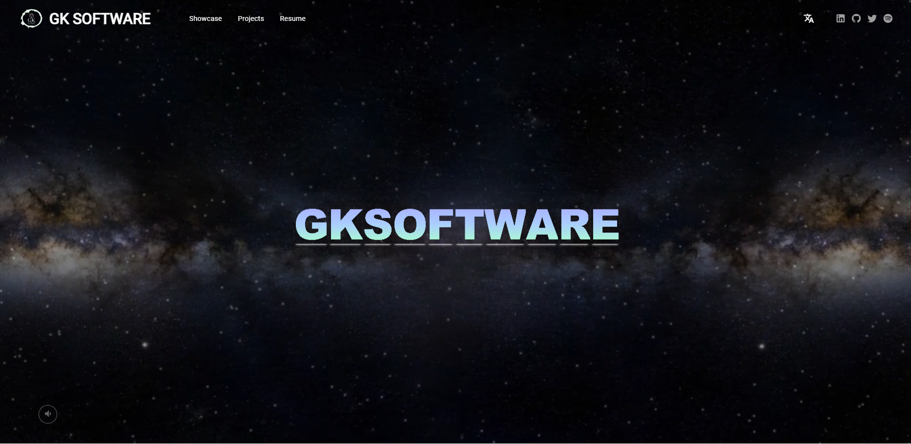
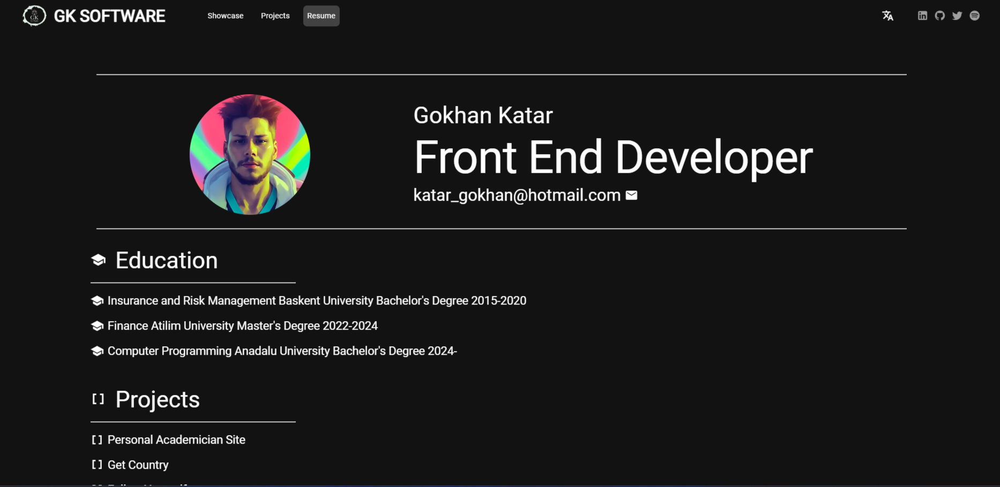
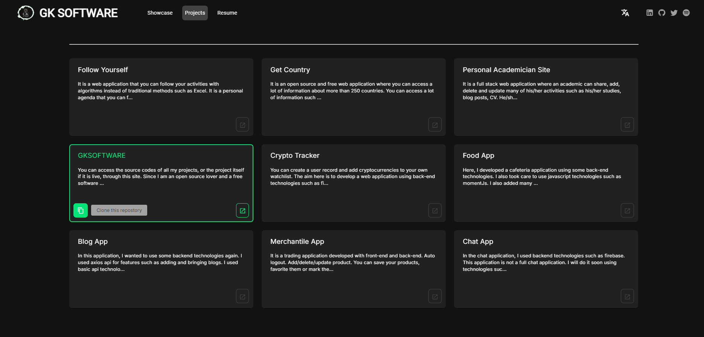
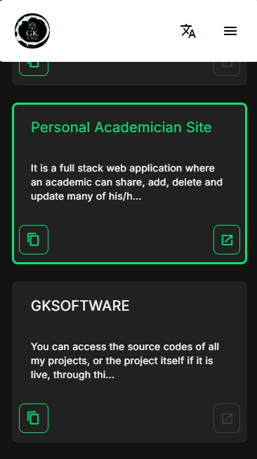

## GKSOFTWARE



## Technologies

- Vue
- Vite
- Vuetify
- Nuxt
- Typescript
- Swiper

# /Resume



# /Showcase


# /Projects



# Mobile View



## 1.Clone Repository

```sh
git clone https://github.com/gokhankatar/gksoftware

```
## 2.Go directory

```sh
cd .\gksoftware\

``` 
## 3.Install Dependencies

### npm

```sh
npm install

```
### pnpm

```sh
pnpm install

```
### yarn

```sh
yarn install

```
### bun

```sh
bun install

``` 
## 4.Run Project

### npm

```sh
npm run dev

```
### pnpm

```sh
pnpm run dev

```
### yarn

```sh
yarn run dev

```
### bun

```sh
bun run dev